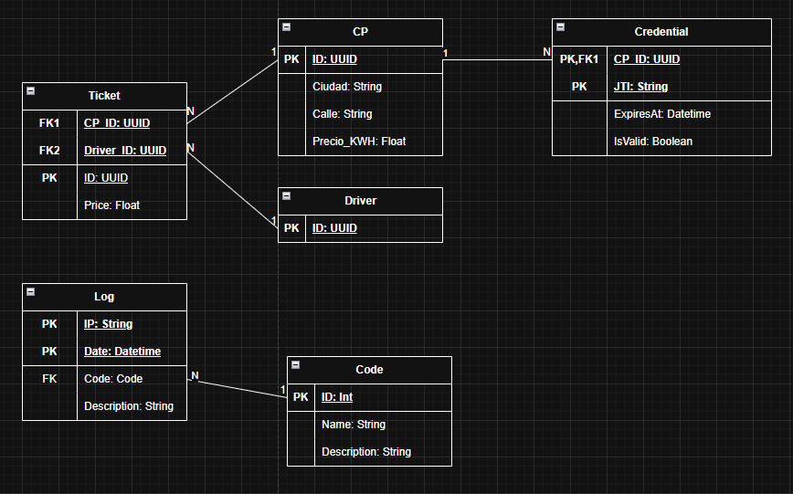

# V2 Funcionalidades
Cosas a tener en cuenta:
- Se tiene que tener una posibilidad de controlar completamente los cps desde la central, ignorando el hecho de que TENGA O NO salida de forntend
  - Se tiene que poder cambiar la localización de un CP
- Tambien se tiene que tener la posiblida de controlar los cps desde la linea de comandos de cada uno
- Cada uno de ellos tiene que mostrar los datos, lo que pasa por pantalla y consola
- Cuenta de administrador guardada como .env para el inicio de sesion en la pagina web

## Diseño tecnico

## EV_Central - NO DOCUMENTADO / SIN DIAGRAMA
### Endpoints

//Especificar payloads de cada endpoint

Especificación de endpoints:
- **Parte del navegador**:
  - https://Ev_central.es/
    - Este es el endpoint del frontend
    - Mostrara todos los datos
    - PERMITE -> (GET) 
               
- **Parte de api**:
  - https://EV_central.es/api/
    - No permite nada                   
    - https://EV_central.es/api/cps/
      - Este endpoint permite guardar cps o leerlos todos
      - PERMITE -> (GET)
      - Post para guardar un endpoint
      - get para leerlos todos
      - Payload (GET):
        - X              
      - https://EV_central.es/api/cps/:id
        - Este endpoint permite trabajar con un cp especifico via su id
        - PEMITE -> (GET, POST)    
        - Payload (GET):
          - X
        - Payload (POST):
          - X
      - https://EV_central.es/api/cps/stop/:id
        - Payload (POST):
          - X
      - https://EV_central.es/api/cps/stop/
        - Payload (POST):
          - X
      - https://EV_central.es/api/cps/break/:id
        - Payload (POST):
          - X
        https://EV_central.es/api/cps/break/
        - Payload (POST):
          - X
      - https://EV_central.es/api/cps/start/:id
        - Payload (POST):
          - X           
      - https://EV_central.es/api/cps/start/
        - Payload (POST):
          - X
      - https://EV_central.es/api/cps/:city
        - Este endpoint permite recibir todos los CPS de una ciudad especifica
        - PERMITE -> (GET)
        - Payload:
          - X       
      - https://EV_central.es/api/cps/cities
        - Este endpoint devuelve todas las ciudades que contengan algun CP
        - PERMITE -> (GET)
        - Payload (GET):
          - X
    - https://EV_central.es/api/drivers/
    	- Este endpoint muestra todos los drivers
      - PERMTIE -> (POST, GET)
      - Payload (POST):
        - X
      - Payload (GET):
        - X
      - https://EV_central.es/api/drivers/:id
      - Este endpoint permite trabajar con un driver especifico
      - PERMiTE -> (GET, DELETE, UPDATE)
      - Payload (GET):
        - X
      - Payload (DELETE):
        - X
      - Payload (UPDATE):
        - X
    - https://EV_central.es/api/receipts/
    - Este endpoint muestra todos los recibos
      - PERMITE -> (POST, GET)
      - Payload (POST):
        - X
      - Payload (GET):
        - X        
      - https://EV_central.es/api/receipts/:id
      - Este endpoint permite trabahar con un recibo especifico
      - PERMITE -> (GET, DELETE, UPDATE)
      - Payload (GET):
        - X
      - Payload (DELETE):
        - X
      - Payload (UPDATE):
        - X   
    - https://EV_central.es/api/alerts/:city
    - Este endpoint sirve para postear alertas en caso de que alguna de las ciudades tenga temperatura negativa, sera usado por **WCO**
    - PERMITE -> (POST)
    - Payload (POST):
      - X
    - https://EV_central.es/api/audit
    - Este endpoint sirve para postear todas las alertas de auditoria
    - Permite -> (POST, GET)

### Practica 2 

Lo que pide la practica:
- **Dato 1 ❌**: Consumo de API_rest de una Oficina de Control de Clima: EV_Central expondrá un interface (API) para que un nuevo módulo llamado EV_W (Weather Control Office) le informe si la localización en la que se encuentra un CP tiene una climatología adecuada para su uso. Para ello, EV_W ante una situación de alerta climatológica en una determinada localización, notificará dicha alerta vía API a EV_Central . Más adelante se indica el funcionamiento de EV_W.
    - A tener en cuenta:
      - Con openWheater se puede hacer llamadas API (Consultas) para una ciudad / region especifica
      - Las consultas se tienen que hacer cada 4 segundos
    - **Mi solución**:
      - ❌ WCO va a tener un banco de datos con las ciudades (Ciudades)
        - El banco de datos sera un array de datos guardados en memoria
        - Tendra el siguente formato:
          - CIUDADES: Array[String] = ["Ciudad1", "Ciudad2"...]
      - ❌ WCO no va a realizar ningun tipo de petición hasta que no tenga al menos una ciudad en su banco de datos
      - ❌ WCO recibira las ciudades que se tiene que tener en cuenta para realizar las consultas cada vez que:
        - Se realiza un cambio en la base de datos respecto a los CPs (POST, UPDATE, DELETE)
        - Recibira las ciudades en este **ENDPOINT** -> http://IpWCO:Puerto/api/cities
        - Con este formato:
          - {ciudad, ciudad, ciudad...}
      - ❌ WCO actualizara el banco de datos cada vez que reciba los datos
      - ❌ Tambien actualizara el banco de datos cada vez que inicie WCO
      - ❌ WCO cada 4 segundos realizara una peticion a https://openweathermap.org/ usando su API:
        - 
        - Este es el formato de la consulta a realizar
        - 
        - Este es el formato de la respuesta a esperar
        - Cada 4 segundos, el programa recorrera el array, realizando las peticiones a cada una de las ciudades dentro de este
        - Al realizar esa peticion y recibir la respuesta, la desenglosa, traduciendo la temperatura de kelvins a grados
        - En el caso de que la temperatura sea negativa, enviara al endpoint de alertas (http://EV_central.es/api/alerts/:city), una alerta.
- **Dato 2 ❌**: Implementación de la autenticación entre EV_Central y los CP: Como se ha comentado anteriormente, para poder realizar la autenticación, los CPs previamente se deberán de haber registrado en el EV_Registry. Tras el proceso de registro los CPs estarán disponibles para su uso. Para ello deberán autenticarse en EV_Central con las credenciales que EV_Registry habrá proporcionado a tal propósito. En el momento de la autenticación, si esta se resuelve con éxito, la central devolverá a EV_M, la clave (de cifrado simétrico ÚNICA POR CP) que deberá ser usada por este para el cifrado de todos los mensajes que envíe a la Central. La central descifrará los mensajes teniendo en cuenta dicha clave. Estas claves podrán ser revocadas por EV_Central ante una supuesta vulnerabilidad de la seguridad. Para simular este efecto, en EV_Central, se implementará una opción para restaurar claves. Al pulsarla, se borrarán las claves de un CP específico el cual quedará fuera de servicio. Esto obligará a EV_CP_M a realizar una nueva autenticación mediante una opción incorporada en el mismo y, de esta manera, obtener sus nuevas claves de cifrado. Opcional: Tal y como se refleja en el diagrama de arquitectura conceptual, la autenticación seguirá siendo por sockets pero el alumno que lo desee podrá implementar un API Rest entre CP y Central a tal propósito lo que, en la práctica profesional sería más correcto. En este caso Central expondría un API de Autenticación que el CP consumiría.

## Base de datos - DOCUMENTADO / DIAGRAMA



Datos:

- CP:
  - **ID**: UUID -> PK  
  - Ciudad: String
  - Calle: String
  - Precio_KWH: Float

- Credential:
  - **CP_ID**: UUID -> PK
  - **Jti**: string -> PK
  - ExpiresAt: Datetime
  - IsValid: boolean

```json
{
  "sub": 123,
  "jti": "aa4f3d2e-8211-4fa6-9d70",
  "exp": 1712440000
}
```
- Driver:
  - **ID**: UUID -> PK

- Ticket:
  - **ID**: UUID -> PK
  - *CP_ID*: UUID -> FK(CP(ID))
  - *Driver_ID*: UUID -> FK(Driver(ID))
  - Price: Float

- Log:
  - **Ip**: String -> PK
  - **Date**: Datetime -> PK
  - Code: Int -> FK(Code(ID))
  - Description: string

- Code:
  - **ID**: Int -> PK
  - Name: String
  - Description: String

## EV Registry - NO DOCUMENTADO / SIN DIAGRAMA

Endpoints:
- https://EV_registry.es/api/cps
  - Registro de CPS
  - Permite -> (POST, GET)
- https://EV_registry.es/api/cps/:id
  - Trabajo con CPS via su id
  - Permite -> (GET, DELETE, UPDATE)
- https://EV_registry.es/api/cps/auth/:id
  - Permite -> (POST)

## Frontend

Aparte necesitare una forma de registrarse con una cuenta de administrador

- Este módulo consistirá en una simple página web que, haciendo peticiones al API_Central, muestre el cuadro de monitorización de la central con todos sus elementos.
- Como se ha comentado anteriormente, este interfaz front deberá contener todos los elementos necesarios para visualizar claramente el estado de situación de todos los elementos del sistema: CPs (incluyendo su estado de registro, activación y token), Drivers, mensajes de error de cualquier parte del sistema, mensajes de estado del EV_W, clima, alertas ante cualquier fallo de cualquier módulo del sistema, etc.

Endpoint: http://EV_central.es/

## CP

//Funcionalidad de registrarse atraves de EV_REGISTRY de forma manual y al crearlo

//Porque va a haber una opcion para dropear TODAS las credenciales de los CPS, se tiene que poder registrarse de nuevo despues de eso, esta vez de forma manual (Alli pues se actualizar en la base de datos el *Creadential*)

## Miscelanea

### Eventos y comandos - NO DOCUMENTADO / SIN DIAGRAMA
Esta seccion sirve para indicar todos los tipos de eventos y comandos posibles, tanto como payload como el registro de auditoria, tendria id y tambien respuesta API

Comandos:
//Create new CP
//Update credential CP

Codigos de error:
// Error de creación


### Autorización y autenticación

Se usara https

Se usara Bearer token

## Casos de uso

### Data and Payloads

#### Estados - ALL
```javascript
  {
    "ACTIVE",
    "WAITING",
    "OUT_OF_SERVICE",
    "CHARGING_CENTRAL",
    "BROKEN",
    "DISCONNECTED"
  }
```
#### CP - ALL
```json
    //With or without credential
  {
    "ID": "UUID",
    "Ciudad": "String",
    "Calle": "String",
    "Precio_KWH": "float",
    //---------------------------- CUANDO MUESTRA ESTADO
    "Estado": "ESTADOS",
    "EstadoIsChanged": "boolean",
    "Timestamp": "String",
    "KafkaOK": "boolean",
    //---------------------------- CUANDO CARGA
    "AlreadyCharged": "float",
    "DriverID": "UUID"
  }
```
#### Ticket - ALL
```json
  {
    "ID": "UUID",
    "CP_ID": "UUID", //FK CP
    "Driver_ID": "UUID", //FK Driver

    //---------------------------- CUANDO EMPIEZA LA CARGA
    "StartTime": "Timestamp",

    //---------------------------- CUANDO ACABA LA CARGA
    "EndTime": "Timestamp", 
    "Price": "Float",
  }
```

#### Driver - ALL
```json
{
  "ID": "UUID",
}
```

#### Logs - ALL
```json
{
  "IP":"String",
  "Date": "Datetime",
  "Code": "Code",
  "Description": "String",
}
```


### EV_CENTRAL 
#### CPs
1. Conseguir todos los CPS -> ```GET https://EV_central/api/cps/``` 
2. Cambiar estado de un CP -> ```POST https://EV_central/api/cps/:id```
   1. CP envia su estado a ```POST https://EV_central/api/cps/:id```
   ```json
   {
    "Estado": "ESTADOS",
    "EstadoIsChanged": "boolean",
   }
   ```
3. Parar 1 CP ->    ```POST https://EV_central/api/cps/stop/:id```
4. Parar ALL CPS -> ```POST https://EV_central/api/cps/stop/```
5. Romper 1 CP ->   ```POST https://EV_central/api/cps/break/:id```
6. Romper ALL CPS ->```POST https://EV_central/api/cps/break/```
7. Start 1 CP -> ```POST https://EV_central/api/cps/start/:id```
8. Start ALL CPS -> ```POST https://EV_central/api/cps/start/```
9. Modificar Precio 1 CP -> ```UPDATE https://EV_central/api/:id```
---
1.  Modificar Localización 1 CP -> ```UPDATE https://EV_central/api/:id```

#### Tickets

1. Leer todos los tickets de la base de datos
2. Crar Ticket
3. Editar ticket
4. Modificar ticket
5. Elimiar ticket

### EV_Registry 

1. Registro de CP -> ```POST https://EV_registry.es/api/cps``` (En el caso de crear un nuevo CP)
   1. Via ```POST https://EV_registry.es/api/cps``` se le enviaran todos los datos del nuevo CP menos Credential
   ```json 
   req = 
   {
    /*TODO Datos del CP*/
    ID,
    Credential,
    ...
   } 
   ```
      1. En el caso de que se envie a ```https://EV_registry.es/api/cps``` sacara el id del payload (osea en js seria ```req.Data```)
   1. Estos datos seran recibidos en el controlador Create ```CPController.create(req, res)``` de los cps de EV_Registry
      1. Este modulo realizara la verificación de que los datos que han llegado son los correctos usando [ZOD](https://zod.dev/basics) y el esquema de un CP
      2. Si no son correctos enviara de vuelta un status ```400``` con un payload de ```{ErrCode: //TODO Error de creación, Description: "En que parte esta el error, la primera que pille"``` (Para esto referirse a [ZOD customización de errores](https://zod.dev/error-customization)) y enviara los mismos datos a ```POST https://EV_central.es/api/audit```
      ``` json
      req = {
        Ip: req.ip
        ErrCode: //TODO Error de creación
        Description: string
      }
      ```
      ***Data sera puesto por el controlador/modulo de audit de ev_central**
   2. Si los datos son correctos enviaran al modulo via 
   ```javascript 
   CPModule.Create({cp: chekedCP /*{ID: UUID, ...}*/ })
   ```
   3. Se creara el CP en la base de datos
   4. Luego viene la parte de autentificación y creación de _Credentials_
      1. //TODO Parte de Hashing y Salting y Credentials
   5. Se devolvera el CP creado con _Credential_
2. Autentificación del CP -> ```POST https://EV_registry.es/api/cps/auth:id``` (En el caso de que ya exista en la base de datos y se necesite actualizar _Credentials_)
   1. Via ```POST https://EV_registry.es/api/cps/auth/:id``` se le solicitara la actualización de credenciales
   2. El controlador se encargara de ver si ese CP existe haciendo un ```GET https://EV_registry.es/api/cps/:id```
      1. En caso de que no exista en la base de datos le enviara como respuesta con codigo ```400``` los siguientes datos
      ```javascript
      res = {
        ErrCode: //TODO Error de autentificación porque no existe en la base de datos
        Description: `CP ${req.params.id} no existe en la base de datos`
      }
      ```
      ```javascript
      //Post https://EV_central.es/api/audit
      payload = {
        Ip: req.ip
        ErrCode: //TODO Error de autentificación porque no existe en la base de datos
        Description: `CP ${req.params.id} no existe en la base de datos`
      }
      ```
      ***Data sera puesto por el controlador/modulo de audit de ev_central**
   3. Si existe entonces
3. Obtener solo un CP -> ```GET https://EV_registry.es/api/cps/:id```
4. Modificación del CP -> ```UPDATE https://EV_registry.es/api/cps/:id```
5. Eliminación del CP -> ```DELETE https://EV_registry.es/api/cps/:id```
6. Obtener todos los CP -> ```GET https://EV_registry.es/api/cps/```


### EV_CENTRAL
### EV_CENTRAL
### EV_CENTRAL
